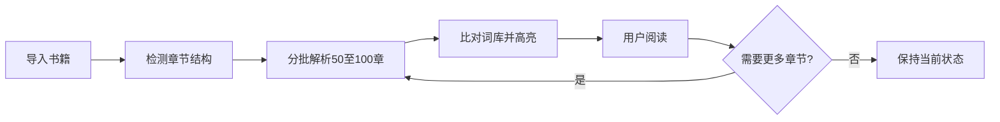
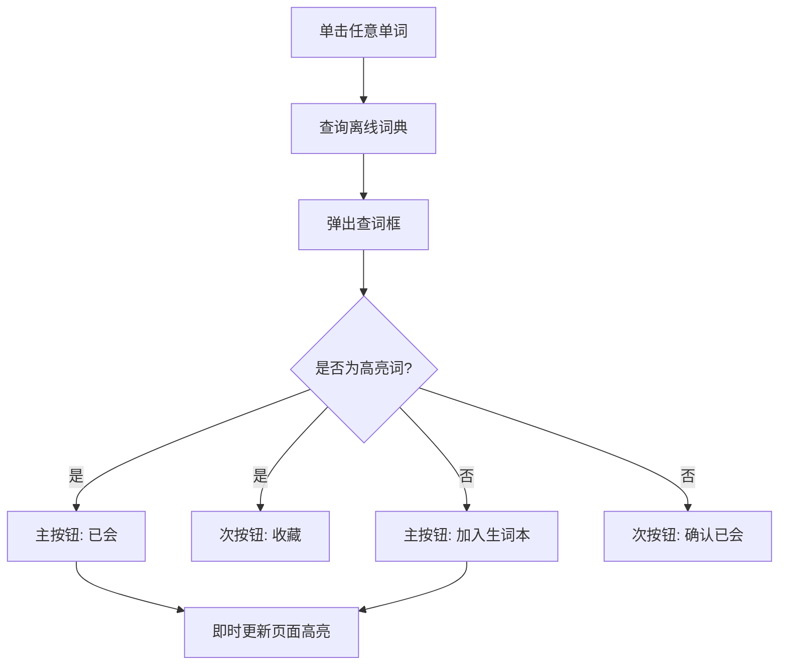
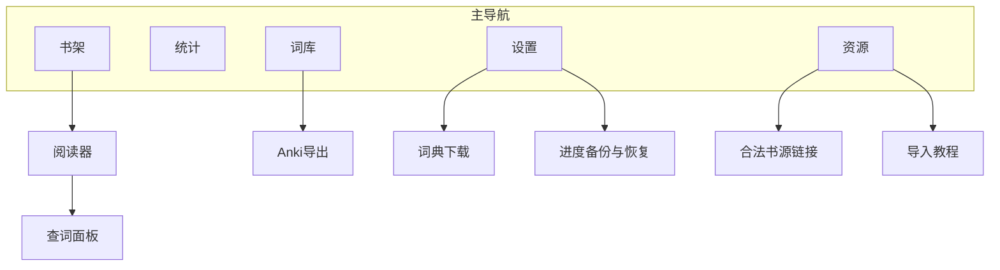

# 沉浸式外语小说阅读器 — 产品需求文档 v0.1

| 字段 | 内容 |
|------|------|
| 文档版本 | v0.1 |
| 状态 | 草案 |
| 最后更新 | 2026-06-19 |
| 目标平台 | 移动端（iOS / Android） |
| 首发语言 | 英文阅读 + 中文释义 |

---

## 1. 产品定位

面向中文用户、专为长篇英文小说设计的本地沉浸式阅读器。

> **一句话定义**：用户自带书，App 负责书之后的一切——解析、高亮、查词、词库管理、进度统计、数据备份。

### 核心价值主张

- **极简视觉**：界面干净纯粹，专注阅读本身，类似日系极简设计
- **高隐私零门槛**：纯本地运行，无需注册账号，所有数据保存在用户设备本地
- **长篇专属优化**：专为动辄几百章的长篇网文/轻小说优化，解决大体积文件导入后卡死崩溃的痛点

---

## 2. 目标用户

既想沉浸式阅读英文长篇小说、又有语言学习需求的中文用户。

**用户画像特征：**

- 已自行获取电子书文件（epub / txt）
- 希望在一个 App 内完成「阅读 + 查词 + 词汇积累」的完整闭环
- 对隐私敏感，不愿上传阅读数据或注册账号
- 对插播广告容忍度低，但可接受克制的节点激励广告

**核心场景：**

用户从合法渠道下载一本英文长篇小说 → 导入 App → 选择词汇水平初始化词库 → 开始沉浸式阅读 → 边读边查词、标记生词/熟词 → 定期查看学习统计 → 将生词导出到 Anki 复习

---

## 3. 核心功能模块

### 3.1 书库与文件管理

| 功能 | 说明 |
|------|------|
| 书架界面 | 书封面缩略图 + 阅读进度百分比 + 最后阅读时间 |
| 文件导入 | 支持 epub、txt 格式 |
| 资源页 | 收录 Project Gutenberg、Standard Ebooks 等合法公版书渠道链接 |
| 导入教程 | 资源页附带「如何从浏览器下载并导入本 App」的操作指引 |

**设计参考：** 书架交互参考月读、KOReader 等信息密度适中的阅读器，而非系统文件管理器。

**明确不做：** 书源聚合、盗版资源分发。App 仅提供合法渠道链接，不承担版权风险。

### 3.2 分批解析引擎

- 采用「读多少解析多少」策略，每次处理 50–100 章
- 不强求全书一次性扫描，保证手机端运行流畅、不发热、不卡顿
- 解析进度与变现节点绑定（见第 5 节）

### 3.3 智能生词高亮

- 用户维护「已知词库」，阅读器自动将不在词库中的词加上显眼高亮
- 摒弃复杂的全书词频运算，以用户个人认知状态为准
- 高亮实时响应词库变化：标记后当前页面即时生效

**词库冷启动方案：**

1. 提供按等级分层的预置词库（CET4 / CET6 / 托福等）供用户选择初始化
2. 支持从 Anki 导出格式导入已有词库
3. 用户在阅读中不断标记生词/熟词，词库动态校准，越用越准

**数据飞轮：** 用户使用越久 → 词库越准确 → 高亮越精准 → 用户粘性越高

### 3.4 查词与词库交互

#### 手势设计

- **单击任意词** → 弹出查词框（高亮词与普通词均可点击）
- 不使用双击（易与系统放大手势冲突）或长按（操作拖沓感强）

#### 查词框自适应逻辑

| 点击词的状态 | 主操作按钮 | 次操作按钮 |
|-------------|-----------|-----------|
| 高亮词（系统认为生词） | ✓ 已会（点后取消高亮） | ★ 收藏 |
| 普通词（系统认为熟词） | ★ 加入生词本（点后变为高亮） | ✓ 确认已会 |

**即时反馈要求：** 用户点击「已会」或「加入生词本」后，阅读页面中该词的高亮状态必须立刻同步更新。

#### 离线词典

- 内置轻量级中英离线词典
- 语言包按需下载，不打包进安装包，控制安装体积

### 3.5 阅读统计

满足「道具感」强的学习者的成就感需求，强化留存：

| 指标 | 说明 |
|------|------|
| 每日阅读时长 | 按天统计，支持查看历史趋势 |
| 新词习得曲线 | 词库增长趋势可视化 |
| 词汇量概览 | 已知词数、生词本词数等核心数字 |

### 3.6 数据导出与备份

| 功能 | 说明 |
|------|------|
| Anki 导出 | 生词本支持导出为 `.apkg` 格式，与 Anki 生态互补 |
| 匿名进度备份 | 可选，以二维码或字符串形式导出阅读进度与词库快照 |
| 无账号设计 | 不绑定账号，用户自行保管备份码，解决换机痛点 |

---

## 4. 信息架构

---

## 5. 变现策略

### 5.1 基本原则

- 基础功能完全免费
- 日常阅读中零横幅广告、零弹窗
- 采用克制的「节点激励广告」，用户主动触发

### 5.2 免费额度

- 新用户首次使用免费解析 **30–50 章**
- 目标：足够用户进入沉浸状态并爱上产品，但尚未读完整本书

### 5.3 节点激励广告

| 规则 | 说明 |
|------|------|
| 绑定对象 | 解析进度（非阅读进度） |
| 触发条件 | 每解锁 100 章的解析额度 |
| 交互方式 | 提示用户观看短视频广告以解锁后续章节解析 |
| 用户感知 | 「解锁处理能力」而非「被打断阅读」 |

---

## 6. 交互与体验原则

1. **操作成本极低**：词库标记、查词等高频动作必须在 2 次点击内完成
2. **即时反馈**：标记熟词后高亮立刻消失，视觉反馈是核心爽感来源
3. **不打扰阅读**：日常阅读中零横幅广告、零弹窗
4. **成长可见**：词库数量、阅读时长等数据让用户感受到投入有回报
5. **本地优先**：所有核心数据默认仅存本地，网络仅用于词典下载、广告、可选备份

---

## 7. 暂不涉及（v0.1 范围外）

| 项目 | 原因 |
|------|------|
| 书源聚合 | 版权风险，不做 |
| 多语言支持 | 当前版本仅支持中英 |
| 社交 / 排行榜 | 与极简定位不符 |
| 强制账号体系 | 与高隐私定位冲突 |

---

## 8. MVP 优先级建议

| 优先级 | 功能 | 理由 |
|--------|------|------|
| P0 | 书库导入 + 分批解析 + 阅读器 | 核心阅读闭环 |
| P0 | 词库冷启动 + 生词高亮 | 差异化核心体验 |
| P0 | 单击查词 + 自适应标记 | 高频交互，决定留存 |
| P1 | 阅读统计 | 成长感与留存钩子 |
| P1 | 节点激励广告 | 变现验证 |
| P2 | Anki 导出 | 生态互补，提升口碑 |
| P2 | 匿名进度备份 | 换机场景，提升长期信任 |
| P2 | 资源页 + 导入教程 | 降低冷启动门槛 |

---

## 9. 开放问题（待后续版本明确）

- 免费解析额度的精确数值（30 章 vs 50 章）需通过 A/B 测试确定
- 预置词库的具体词表来源与授权方式
- 离线词典的技术选型与体积上限
- 匿名备份的数据加密与格式规范
