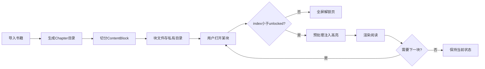
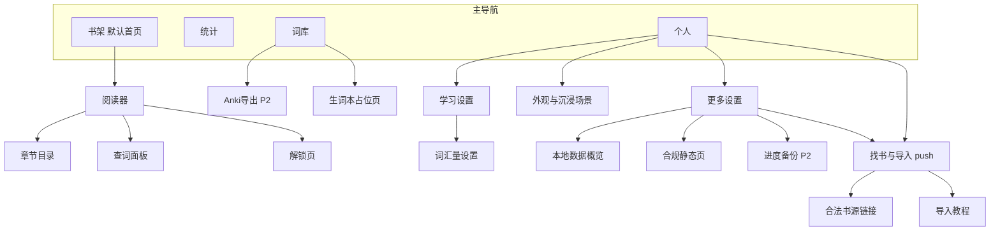

# 沉浸式外语小说阅读器 — 产品需求文档 v0.2

| 字段 | 内容 |
|------|------|
| 文档版本 | v0.2 |
| 状态 | 已定稿（含用户流程、状态机、POC 计划） |
| 最后更新 | 2026-06-28（Sprint 9 Tab IA 重构） |
| 目标平台 | 移动端（iOS / Android） |
| 首发语言 | 英文阅读 + 中文释义 |
| 配套文档 | [技术选型](./tech-stack.md) · [数据模型](./data-model.md) · [用户流程](./user-flow.md) · [POC 计划](./poc-plan.md) |

---

## 1. 产品定位

面向中文用户、专为长篇英文小说设计的本地沉浸式阅读器。

> **一句话定义**：用户自带书，App 负责书之后的一切——解析、高亮、查词、词库管理、进度统计、数据备份。

### 核心价值主张

- **极简视觉**：界面干净纯粹，专注阅读本身，类似日系极简设计
- **高隐私零门槛**：纯本地运行，无需注册账号，所有数据保存在用户设备本地
- **长篇专属优化**：专为动辄几百章的长篇网文/轻小说优化，解决大体积文件导入后卡死崩溃的痛点
- **保留 EPUB 阅读体验**：排版、斜体、插图通过 HTML 渲染保留，而非转为纯文本

---

## 2. 目标用户

既想沉浸式阅读英文长篇小说、又有语言学习需求的中文用户。

**用户画像特征：**

- 已自行获取电子书文件（epub / txt）
- 希望在一个 App 内完成「阅读 + 查词 + 词汇积累」的完整闭环
- 对隐私敏感，不愿上传阅读数据或注册账号
- 对插播广告容忍度低，但可接受克制的节点激励广告

**核心场景：**

用户从合法渠道下载一本英文长篇小说 → 导入 App → 选择词汇水平初始化词库 → 开始沉浸式阅读 → 边读边查词、标记生词/熟词 → 定期查看学习统计 → 将生词导出到 Anki 复习

---

## 3. 核心功能模块

### 3.1 书库与文件管理

| 功能 | 说明 |
|------|------|
| 书架界面 | 列表布局；封面 + 书名 + 作者 + 进度 + 最后阅读时间 |
| 文件导入 | 支持 epub、txt 格式 |
| 资源页 | 收录 Project Gutenberg、Standard Ebooks 等合法公版书渠道链接 |
| 导入教程 | 资源页附带「如何从浏览器下载并导入本 App」的操作指引 |

#### 书架规格（P1-08）

| 元素 | 规格 |
|------|------|
| 布局 | 列表（非网格）；书架为 App **默认首页** |
| 封面 | 缩略图约 48×72；无封面时占位图 + 书名首字 |
| 书名 | 1 行显示，超出省略 |
| 作者 | 有则显示（灰色小字），无则隐藏 |
| 进度 | 细进度条 + 百分比（0% 不额外显示「未开始」） |
| 时间 | 最后阅读时间，相对格式（刚刚 / 今天 / 昨天 / N 天前） |
| 排序 | 默认按 `reading_progress.updatedAt` 降序（最近阅读） |
| 空状态 | 引导「导入书籍」与「打开找书指南」（push 资源页） |
| 交互 | 点击卡片进入阅读器；MVP 无长按菜单 |

**设计参考：** 书架交互参考月读、KOReader 等信息密度适中的阅读器，而非系统文件管理器。

**明确不做：** 书源聚合、盗版资源分发。App 仅提供合法渠道链接，不承担版权风险。

**导入规则：** 导入 EPUB/TXT 时必须生成 Chapter 记录；禁止将全书合并为单一文件而导致目录与跳转丢失。

### 3.2 分批解析引擎

采用「读多少处理多少」策略，以 **ContentBlock（内容块）** 为处理单位，而非「章」。

| 原则 | 说明 |
|------|------|
| 不全书扫描 | 打开某块时才预处理该块，避免卡死与发热 |
| EPUB 路线 C | 按 spine 保留 HTML；超长块（>12,000 字符）子切为多块 |
| TXT 统一管线 | 同样生成 Chapter + ContentBlock，块内为纯文本 |
| 块存储 | 每块一个文件，存于应用私有目录，不写入数据库 BLOB |
| 变现绑定 | 解锁与预处理额度按 `globalBlockIndex` 计（见第 5 节） |
| 额度校验 | 仅当 `globalBlockIndex < unlockedBlockCount` 时可预处理该块 |



技术细节见 [技术选型](./tech-stack.md)。

### 3.3 智能生词高亮

- 用户维护「已知词库」，阅读器自动将不在词库中的词标记为生词
- 摒弃复杂的全书词频运算，以用户个人认知状态为准
- 高亮实时响应词库变化：标记后**当前内容块**即时重绘

**高亮判定唯一规则：** `word NOT IN known_words`（内存 Set）→ 显示虚线下划线；否则正常显示。

**全局词库：** `known_words` 为全局表，跨书共享。在书 A 标为已会的词，在书 B 中同样不再高亮，这是预期行为。

#### EPUB 实现（路线 C）

渲染前在 HTML 文本节点注入：

```html
<span class="word unknown" data-word="bright">bright</span>
```

#### TXT 实现

使用 `Text.rich` + `TextSpan` 逐词渲染；`unknown` 词加 `decoration: dashed underline`。归一化与 Set 比对逻辑与 EPUB 相同。

| 样式 | 显示效果 |
|------|----------|
| 生词（unknown） | **虚线下划线** |
| 熟词（known） | **正常显示，无高亮** |

**词形归一化（MVP v1）：**

| 规则 | 示例 |
|------|------|
| 转小写 | `Bright` → `bright` |
| 去首尾标点 | `word,` → `word` |
| 缩写整词保留 | `don't` → `don't` |
| 不做词干化 | `brightly` 与 `bright` 分开处理 |

`data-word`（EPUB）或内部词键（TXT）存放归一化词形；页面仍显示书中原文。

#### 词库冷启动向导（P1-07）

**触发：** 首次启动 App；可「稍后再说」跳过。

**跳过补救：** 词库为空时，首次打开阅读器显示可关闭轻提示：「词汇量未设置，生词可能偏多」。

**3 步流程：**

1. **欢迎**：说明词汇量用于控制生词下划线
2. **选择**：预置等级 **或** 从 txt/csv 词表导入
3. **确认**：展示将标记为「已会」的词数 → 批量写入 `known_words` → 加载内存 Set

**预置等级（高级叠加低级）：**

| 选项 | 约词数 | source 标识 |
|------|--------|-------------|
| 高中 / 四级 | ~4,500 | `preset_cet4` |
| 六级 | ~6,000 | `preset_cet6`（含四级） |
| 托福 / 雅思 | ~8,000 | `preset_toefl` |
| 熟练 | ~12,000 | `preset_advanced` |

**导入：** 屏 2 次要入口；MVP 支持 **txt/csv 词表**（每行一词或 word 列）。Anki `.apkg` 导入延至 P2。

**后续管理（个人 → 学习设置 / 词库 Tab）：**

- 查看已知词数
- 重选等级：**追加合并**（不覆盖已有 `known_words`）
- 提供「重置词库」（清空后需重新设置）
- 词表文件导入（同向导）

**数据飞轮：** 用户使用越久 → 词库越准确 → 高亮越精准 → 用户粘性越高

**词库 Tab（Sprint 9）**：累计已知、等级进度、成长里程碑、生词本 Card（`countVocabEntries` + push `VocabNotebookScreen` 占位页）。生词本词数主展示在词库 Tab，统计 Tab 与个人头部不重复。

### 3.3.1 个人中心（Sprint 7 / 9）

无账号体系；底部 Tab「个人」为设置聚合入口。

| 区域 | 内容 |
|------|------|
| 头部 | 默认头像 + 昵称「阅读者」；状态语「点击查看阅读统计」（无连续/累计数字） |
| 能力勋章墙 | 生词本（push 占位页）/ Anki / 备份 三格；后两者锁定占位 |
| 外观 & 沉浸场景 | 全局默认字号、行距、三档背景；可选「主页壁纸随动」 |
| 学习设置 | 已知词数、重跑向导、重置词库（与词库 Tab 双入口） |
| 更多设置 | 本地数据概览、**找书与导入**（push 资源页）、合规静态页、清除缓存、版本号、匿名本地 ID |

阅读器内「设置」浮层与个人中心「外观」共用 `ReaderPreferences` / `SharedPreferences` 键；浮层可临时调节，外观页设全局默认。

### 3.4 查词与词库交互

#### 阅读器布局

| 元素 | 行为 |
|------|------|
| 正文区 | 垂直滚动；按 `storageType` 加载 HTML 或纯文本块；**固定阅读边距**，不随顶底栏显隐变化 |
| 顶栏 / 底栏 | **Stack overlay** 悬浮于正文之上；`AnimatedSlide` + `AnimatedOpacity`（~200ms）显隐；**不改变 ScrollView 视口高度** |
| 顶栏内容 | 返回 + 书名 + 当前章标题（精简，无目录/设置入口） |
| 底栏内容 | **上层**：上一章 / 章标题 pill / 下一章 + 阅读进度%；**下层**：目录、阅读设置、夜间模式（3 图标） |
| 顶底栏切换 | 单击非词区域切换显示/隐藏（沉浸模式） |
| 阅读设置 | 底栏「设置」toggle 内嵌浮层（非 modal sheet）：亮度滑块、字号 A±、三档背景圆点、行距 ±；偏好 `SharedPreferences` 持久化 |
| 系统亮度 | 滑块调节 OS 屏幕亮度；退出阅读器不强制还原（记忆用户偏好） |
| 顶底栏配色 | chrome 与正文 `backgroundColor` 同源，消除背景切换色带 |
| 夜间模式 | 底栏「夜间」一键切换；同步更新 chrome、查词卡、生词高亮色 |
| 目录 | 列出 Chapter 表；点击跳转至该章第一块 |
| 块衔接 | 滚至块末自动加载下一块；跨章时顶栏章标题更新 |
| 解锁进度 | 底栏「已解锁 x/y 段」为 **可选** MVP 功能 |

#### 手势设计

- **单击任意词**（HTML span 或 TXT TextSpan）→ 弹出**居中查词卡**（Dialog）
- 单击非词区域 → 切换顶底栏
- 不使用双击或长按

#### 查词面板

- **位置**：屏幕居中 Dialog（`showGeneralDialog`），宽约 88% 屏宽；半透明遮罩点击关闭；**非**底部半屏 sheet
- **布局**：衬线词头 + 考试标签 chip + 音标行（🇺🇸 + IPA）+ TTS + 分词性中文释义（卡片内最多 3 个 sense）+「查看详细释义 >」+ 底部全宽「不认识」「已会」
- **详情页**：`WordDetailScreen` 全屏展示完整释义、可折叠英文释义、词形变化、Collins/Oxford 徽章；保留「不认识 / 已会」
- **语义映射**：UI 仅两按钮；后端按词当前状态（生词/熟词）映射至原四操作（见下表）
- **视觉反馈**：点击「已会」→ SnackBar「已标记为已会」；熟词点「不认识」→ SnackBar「已加入生词本」；延迟 ~250ms 后关闭
- **主题**：查词卡背景/文字色随阅读偏好（含夜间模式）变化
- **无释义**：显示「词典未收录该词」；TTS 仍可读单词；有 entry 时可进详情页查看「暂无详细释义」

| 按钮 | 生词（不在 known_words） | 熟词（在 known_words） |
|------|--------------------------|------------------------|
| 不认识 | 无 DB 操作 | 加入生词本（DELETE known + INSERT vocab） |
| 已会 | 标记已会（INSERT known_words） | 确认已会（幂等 INSERT） |

**即时反馈：** 有 DB 写入时更新内存 Set，**仅重绘当前 ContentBlock**。

#### 离线词典

- MVP：内置 `mvp_dict.json`（**10k** 词条，ECDICT 裁剪，约 4.8MB）；启动预加载；**不做词干化**（见 `future-stemming.md`）
- P1：按需下载完整词典包
- 详见 [技术选型 — 词典](./tech-stack.md#7-离线词典)

### 3.5 阅读统计

统计 Tab 采用**四段式仪表盘**（激励 + 情境，非第二个书架）；**不含词汇资产数字**（无生词本词数、无累计已知词——后者见词库 Tab §3.3）。

| 段 | 内容 | 状态 |
|----|------|------|
| 正在阅读 | 最近一书封面 + 进度 %；点击续读 | ✅ MVP |
| 我的数据 | 今日新词、今日阅读、累计时长（单行 3 卡） | ✅ MVP |
| 近 7 日 | 每日阅读分钟柱状图 | ✅ MVP |
| 连续阅读 | 7 天圆点 + 连续天数 | ✅ MVP |

| 指标 | 说明 | 状态 |
|------|------|------|
| 每日阅读时长 | 按天统计，近 7 日趋势 | ✅ UI；阅读器自动埋点待接 |
| 今日新词 | `known_words.addedAt` 当日增量（行为快照） | ✅ MVP |
| 累计已知 / 生词本词数 | 主展示在词库 Tab；个人勋章墙为次要数字 | ✅ Sprint 9 去重 |
| 新词习得曲线 | 词库增长趋势可视化（如 30 日） | P2 |

### 3.6 数据导出与备份

| 功能 | 说明 |
|------|------|
| Anki 导出 | 生词本导出为 `.apkg`（P2） |
| Anki 导入 | `.apkg` 词库导入（P2）；MVP 仅 txt/csv |
| 匿名进度备份 | 可选，二维码或字符串形式（P2） |
| 无账号设计 | 不绑定账号，用户自行保管备份码 |

### 3.7 章节与跳转

| 概念 | 面向 | 用途 |
|------|------|------|
| **Chapter** | 用户 | 目录列表、章标题、跳转、进度展示 |
| **ContentBlock** | 引擎 | 加载、预处理、高亮、广告解锁 |

**关系规则：**

- 默认 **1 章 = 1 块**
- 单章超过 12,000 字符 → **1 章 = 多块**（目录仍一行）
- 多个 spine 项合并为一章 → **1 章 = 多块**
- 目录只展示 Chapter

**EPUB：** 按 spine + 目录生成 Chapter；资源复制至 `books/{bookId}/assets/`，块内 HTML 重写相对路径。

**TXT：** 正则匹配 `Chapter N` 等分章；失败则按 12,000 字符切块，Chapter 标题用「第 N 段」等通用名。

**跳转：** 点击目录第 N 章 → 该章 `blockOrderInChapter = 0` 的块 → 打开阅读器。

### 3.8 查词状态机

高亮仅由 `known_words` 决定；`vocab_entries`（生词本）记录学习收藏，不改变高亮判定（除非触发「加入生词本」移除 known）。

| 操作 | 起始 | `known_words` | `vocab_entries` | 高亮变化 |
|------|------|---------------|-----------------|----------|
| 已会 | 生词 | INSERT | 保留已有记录 | 下划线消失 |
| 收藏 | 生词 | 不变 | INSERT/UPDATE `starred=true` + 例句 | 保持 |
| 加入生词本 | 熟词 | DELETE | INSERT + 例句 | 下划线出现 |
| 确认已会 | 熟词 | INSERT（幂等） | 不变 | 保持 |
| 取消收藏 | 生词/熟词 | 不变 | UPDATE `starred=false` | 保持 |

**收藏 vs 加入生词本：** 收藏不改动 `known_words`，仅加入生词本；加入生词本先从 `known_words` 删除再写入生词本。

详见 [数据模型 — 查词状态机](./data-model.md#9-查词状态机与表写入)。

---

## 4. 信息架构



---

## 5. 变现策略

### 5.1 基本原则

- 基础功能完全免费
- 日常阅读中零横幅广告、零弹窗
- 节点激励广告，用户主动触发

### 5.2 免费额度

- 每本书导入后 `unlockedBlockCount = 40`
- 可预处理块：`globalBlockIndex` 为 **0-based**，满足 `index < 40`（即第 0–39 块，共 40 块）

### 5.3 节点激励广告

| 规则 | 说明 |
|------|------|
| 绑定对象 | 预处理额度（`globalBlockIndex` 与 `unlockedBlockCount`） |
| 触发条件 | 滚至下一块且 `globalBlockIndex >= unlockedBlockCount` |
| 解锁增量 | 每观看一次激励视频 → `unlockedBlockCount += 100` |
| 用户感知 | 「解锁更多段」，非「被打断阅读」 |

### 5.4 解锁交互（P1-10）

| 项 | 规格 |
|----|------|
| 界面 | **全屏解锁页**（非弹窗） |
| 文案 | 对用户称「段」（如「已读 40 段」「解锁 100 段」） |
| 返回 | 可返回继续读已解锁内容，不绑架 |
| 首次触达 | 一次性说明免费机制，之后不重复 |
| 广告失败 | 提示重试；**不送额度、不放行** |
| 中途关闭 | 视为未完成，停留解锁页 |
| 无网络 | 可读已解锁块；不可开新块 |
| POC | 模拟「观看 3 秒」按钮代替真实 SDK |

---

## 6. 交互与体验原则

1. **操作成本极低**：词库标记、查词须在 2 次点击内完成
2. **即时反馈**：标记熟词后下划线立刻消失
3. **不打扰阅读**：日常零横幅、零弹窗
4. **成长可见**：词库数量、阅读时长可见
5. **本地优先**：核心数据仅存本地
6. **排版优先**：EPUB 保留 HTML；TXT 用 TextSpan 双管线

---

## 7. 暂不涉及

| 项目 | 原因 |
|------|------|
| 书源聚合 | 版权风险 |
| 多语言 | 当前仅中英 |
| 社交 / 排行榜 | 与极简定位不符 |
| 强制账号 | 与高隐私冲突 |
| 词干化 | MVP 不做 |
| Anki `.apkg` 导入 | P2 |

---

## 8. MVP 优先级

| 优先级 | 功能 |
|--------|------|
| P0 | 书库导入（EPUB+TXT）+ 分批块处理 + 双管线阅读器 |
| P0 | 词库冷启动向导 + 生词高亮 + 查词状态机 |
| P0 | 单击查词 + 章节目录跳转 |
| P1 | 阅读统计 |
| P1 | 节点激励广告（按块解锁） |
| P1 | 资源页 + 导入教程 |
| P2 | Anki 导出 / 导入 |
| P2 | 匿名进度备份 |

---

## 9. 开放问题

- 预置词库词表来源与授权
- 完整离线词典方案（StarDict/MDX 等，P1）
- 匿名备份加密与格式
- 词干化是否纳入 P1
- 阅读器横翻可选模式
- `flutter_widget_from_html` POC 最终确认
- `epubx` POC 结论

---

## 10. 已敲定决策摘要

| 决策项 | 结论 | 详见 |
|--------|------|------|
| 跨平台框架 | Flutter | [tech-stack.md](./tech-stack.md) |
| 本地数据库 | Drift + 内存 Set | [tech-stack.md](./tech-stack.md) |
| EPUB 策略 | 路线 C | [tech-stack.md](./tech-stack.md) |
| TXT 策略 | TextSpan 双管线 | [tech-stack.md](./tech-stack.md) |
| 数据模型 | Chapter + ContentBlock | [data-model.md](./data-model.md) |
| 解锁边界 | 0-based；free=40 即 index 0–39 | [data-model.md](./data-model.md) |
| 查词状态机 | 见 §3.8 | [data-model.md](./data-model.md) |
| 词库向导 | 3 步，4 档叠加，txt/csv | [user-flow.md](./user-flow.md) |
| 书架 | 列表，最近阅读，默认首页 | [user-flow.md](./user-flow.md) |
| 广告交互 | 全屏解锁页，段文案 | [user-flow.md](./user-flow.md) |
| 生词高亮 | 虚线下划线 | §3.3 |
| 词归一化 | 小写+去标点；缩写整词 | §3.3 |
| POC | 两阶段验证 | [poc-plan.md](./poc-plan.md) |
