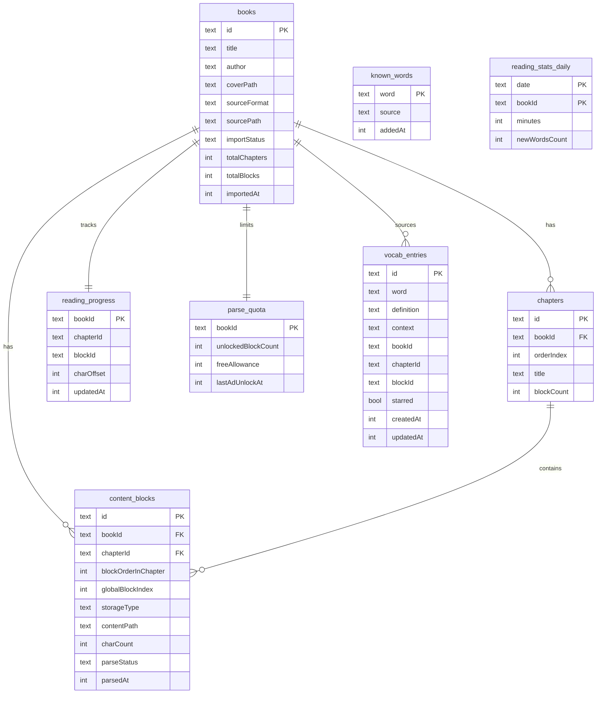
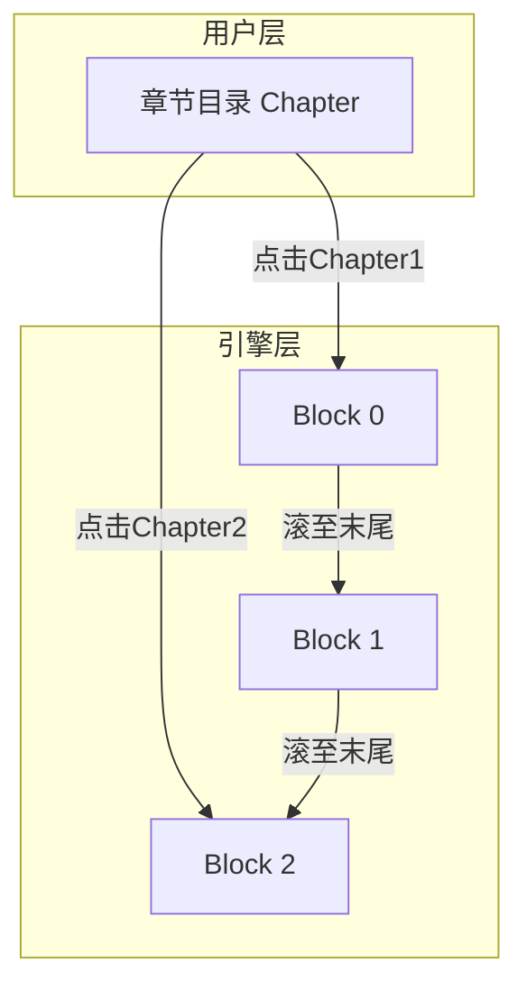
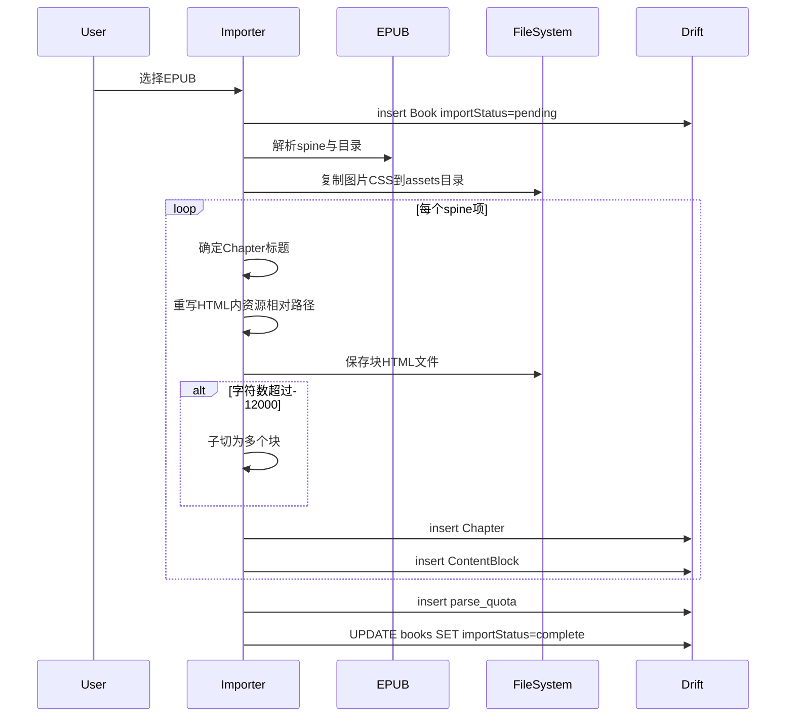
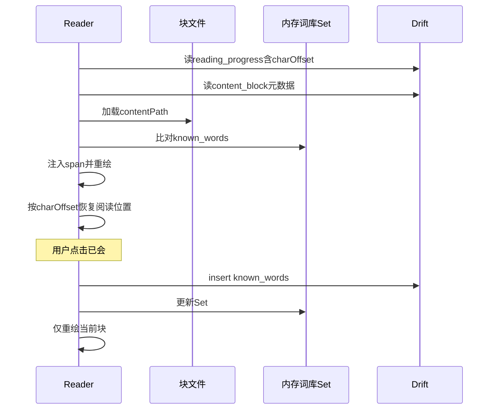
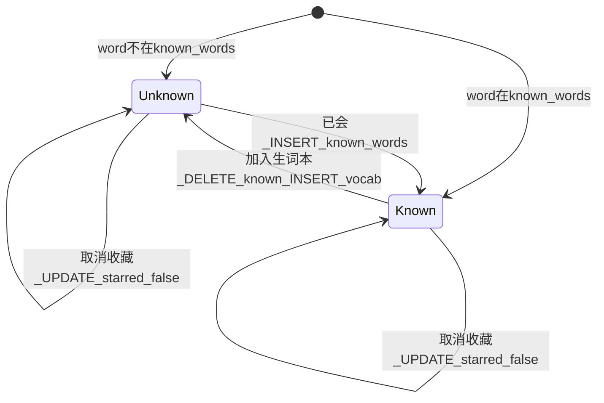
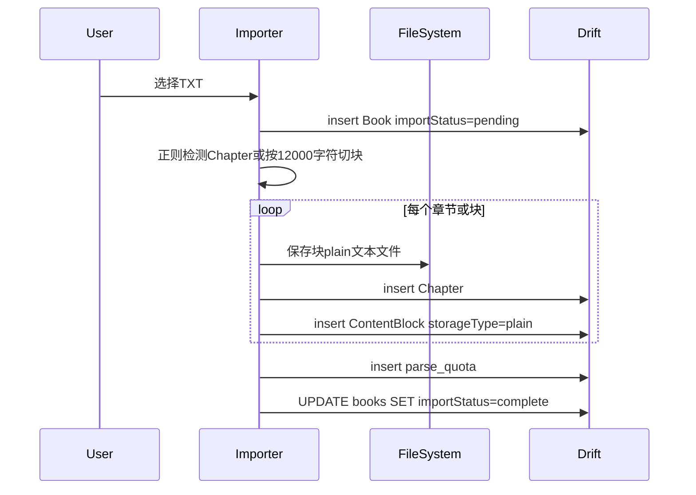

# 数据模型

| 字段 | 内容 |
|------|------|
| 文档版本 | v1.2 |
| 状态 | 已定稿 |
| 最后更新 | 2026-06-28（Sprint 11 全书可读 + 时长埋点） |
| 关联 PRD | [PRD v0.3](./PRD-v0.3.md) |
| 数据库 | Drift (SQLite) |

---

## 1. 设计原则

| 原则 | 说明 |
|------|------|
| 章块分离 | Chapter 面向用户目录；ContentBlock 面向引擎加载 |
| 块即预处理单位 | `globalBlockIndex` 驱动按需预处理；v1.0 全书可读 |
| 大内容外置 | HTML/文本存文件，数据库只存元数据 |
| 词库可扩展 | `known_words.source` 预留预置词库与拓展词包 |

---

## 2. 实体关系图



---

## 3. 表定义

### 3.1 `books` — 书籍

| 字段 | 类型 | 说明 |
|------|------|------|
| id | TEXT PK | UUID |
| title | TEXT | 书名 |
| author | TEXT? | 作者 |
| coverPath | TEXT? | 封面本地路径 |
| sourceFormat | TEXT | `epub` / `txt` |
| sourcePath | TEXT | 原始导入文件路径（元数据/调试；阅读内容已按块存私有目录） |
| importStatus | TEXT | `pending` / `complete` / `failed`；导入完成后置 `complete`；书架只显示 `complete` |
| totalChapters | INT | 章数（冗余，书架展示） |
| totalBlocks | INT | 总块数（解锁计算） |
| importedAt | INT | 导入时间戳 |

### 3.2 `chapters` — 章节目录（用户可见）

| 字段 | 类型 | 说明 |
|------|------|------|
| id | TEXT PK | UUID |
| bookId | TEXT FK | 所属书 |
| orderIndex | INT | 目录排序，从 0 起 |
| title | TEXT | 章标题（来自 EPUB 目录或启发式） |
| blockCount | INT | 该章含块数，通常 1 |

**目录跳转：** 点击第 N 章 → 查 `orderIndex = N` → 取该章 `blockOrderInChapter = 0` 的 ContentBlock。

### 3.3 `content_blocks` — 内容块（引擎单位）

| 字段 | 类型 | 说明 |
|------|------|------|
| id | TEXT PK | UUID |
| bookId | TEXT FK | 所属书 |
| chapterId | TEXT FK | 所属章 |
| blockOrderInChapter | INT | 章内块序号，从 0 起 |
| globalBlockIndex | INT | 全书块序号，**解锁与广告用** |
| storageType | TEXT | `html` / `plain` |
| contentPath | TEXT | 块文件路径（私有目录） |
| charCount | INT | 纯文本字符数（`String.length`） |
| parseStatus | TEXT | `pending` / `processing` / `done` / `failed` |
| parsedAt | INT? | 预处理完成时间 |

### 3.4 `reading_progress` — 阅读进度

| 字段 | 类型 | 说明 |
|------|------|------|
| bookId | TEXT PK | 一书一条 |
| chapterId | TEXT | 当前章 |
| blockId | TEXT | 当前块 |
| charOffset | INT | 块内已读字符偏移（与设备/字体无关） |
| updatedAt | INT | 最后更新时间 |

**书架进度百分比：**

```
progress = (currentBlock.globalBlockIndex + charOffset / block.charCount) / book.totalBlocks
```

取值范围 `[0.0, 1.0]`；书架显示时 ×100 取整为百分比。`charOffset` 用于重绘后恢复阅读位置，不依赖像素滚动偏移。

### 3.5 `known_words` — 已知词库

**全局设计：** 无 `bookId` 字段，跨书共享。在书 A 标为已会的词，在书 B 中同样不再高亮（预期行为）。

| 字段 | 类型 | 说明 |
|------|------|------|
| word | TEXT PK | 归一化词形（小写、去首尾标点）；**仅存表面词形**（Sprint 10：标记 `ringing` 不会写入 `ring`） |
| source | TEXT | `user` / `preset_cet4` / `pack_xxx` |
| addedAt | INT | 加入时间 |

启动时加载至内存 `Set<String>`；标记「已会」时同步写入。查词回落（`DictLoader.resolve()` → 别名 → lemma 释义）**不改变**高亮判定，仍仅精确匹配此 Set。

### 3.6 `vocab_entries` — 生词本

| 字段 | 类型 | 说明 |
|------|------|------|
| id | TEXT PK | UUID |
| word | TEXT | 归一化词形 |
| definition | TEXT? | 收藏时的释义快照 |
| context | TEXT? | 上下文例句 |
| bookId | TEXT? | 来源书 |
| chapterId | TEXT? | 来源章 |
| blockId | TEXT? | 来源块（精确定位例句） |
| starred | BOOL | 是否收藏；默认 `false` |
| createdAt | INT | 创建时间 |
| updatedAt | INT | 收藏状态变更时间（支持「最近收藏」排序） |

**`starred` 默认值与操作：**

| 操作 | `starred` 写入 |
|------|----------------|
| 收藏 | `true` |
| 加入生词本 | `false`（默认） |
| 取消收藏 | `false` |

### 3.7 `parse_quota` — 预处理额度（v1.0 全书可读）

| 字段 | 类型 | 说明 |
|------|------|------|
| bookId | TEXT PK | 一书一条 |
| unlockedBlockCount | INT | 可预处理的最大块数；**v1.0 导入时 = `books.totalBlocks`** |
| freeAllowance | INT | 历史字段；v1.0 与 `unlockedBlockCount` 同步写入 `totalBlocks` |
| lastAdUnlockAt | INT? | **已废弃**（P1-09 广告取消）；保留列供旧库兼容 |

**v1.0 规则：**

- `globalBlockIndex`：**0-based**，全书从 0 递增
- 新书导入：`initParseQuota(bookId, totalBlocks: n)` → `unlockedBlockCount = n`
- 旧库升级：`migrateParseQuotaToFullBook()` 在 `beforeOpen` 将仍受 40 块墙限制的额度提升至全书
- **可预处理**：`globalBlockIndex < unlockedBlockCount`（v1.0 下等价于全书可读）
- **无广告解锁路径**；`unlockAfterAd` 已移除

### 3.8 `reading_stats_daily` — 每日统计

| 字段 | 类型 | 说明 |
|------|------|------|
| date | TEXT PK（复合） | `YYYY-MM-DD` |
| bookId | TEXT PK（复合） | 所属书；`NULL` 表示当日全站合计行 |
| minutes | INT | 当日阅读分钟 |
| newWordsCount | INT | 当日新增 `known_words` 数 |

**统计 Tab 查询（`database.dart`）：**

| 方法 | 用途 |
|------|------|
| `getLastReadBook()` | 最近有 `reading_progress` 的书 + 进度 |
| `getTodayNewWords()` | 今日 `known_words.addedAt` 计数 |
| `getTotalReadingMinutes()` | 全站合计行 `minutes` 之和 |
| `getDailyMinutesTrend(days)` | 近 N 日分钟趋势（默认 7） |
| `incrementDailyMinutes(date, deltaMinutes, bookId?)` | 累加当日分钟（全站 `bookId IS NULL` + 可选 per-book） |
| `countKnownWords()` | 词库 Tab 累计已知词（主展示） |
| `countVocabEntries()` | 词库 Tab 生词本入口 / 个人勋章墙 |
| `watchVocabEntries()` | 生词本列表页 Stream（`updatedAt DESC`） |

`countKnownWords()` 的主展示位仅在词库 Tab；统计 Tab 与个人头部不重复该数字。

---

## 4. Chapter 与 ContentBlock 关系规则

| 场景 | Chapter | ContentBlock | 用户感知 |
|------|---------|--------------|----------|
| 默认 EPUB spine | 1 | 1 | 一章一行目录 |
| 长章 >12,000 字符 | 1 | N | 目录仍一行，内部无感多块 |
| 多 spine 合并一章 | 1 | N | 目录一行，内容顺序拼接 |
| TXT 正则分章 | 1 | 1 或 N | 同 EPUB 逻辑 |



---

## 5. 导入落表流程（EPUB）



**约束：** 禁止全书合并为单文件而不生成 Chapter 记录。

**导入失败：** 任一步骤异常时 `UPDATE books SET importStatus=failed`；书架不展示 `pending` / `failed` 的书；用户可重新导入（覆盖或清理后重试）。

---

## 6. 删除书籍规范

用户从书架删除一本书时，按以下规则处理：

| 对象 | 操作 |
|------|------|
| `content_blocks` | DELETE（按 `bookId` 级联） |
| `chapters` | DELETE |
| `parse_quota` | DELETE |
| `reading_progress` | DELETE |
| `vocab_entries` | **保留**；`UPDATE SET bookId=NULL`（词汇积累不丢失） |
| 文件系统 | 删除 `{appDocuments}/books/{bookId}/` 目录（含块文件与 assets） |
| `books` | DELETE |

**顺序建议：** 先删文件系统与块元数据，再删 `books` 主记录，最后批量 `vocab_entries.bookId` 置 null。

---

## 7. 运行时数据流（阅读单块）



---

## 8. 关键参数

| 参数 | 值 | 单位 | 关联 |
|------|-----|------|------|
| 长章子切阈值 | 12,000 | 字符数（`String.length`） | `content_blocks` 拆分 |
| v1.0 全书可读 | `unlockedBlockCount = totalBlocks` | 块 | `parse_quota` 导入时写入 |

---

## 9. 查词状态机与表写入

**高亮判定：** 仅看 `known_words` 内存 Set。`vocab_entries` 为生词本元数据，默认不改变高亮。



| 操作 | 起始 | `known_words` | `vocab_entries` | 高亮 |
|------|------|---------------|-----------------|------|
| 已会（查词卡「已会」） | 生词 | INSERT | 保留已有 | 消失 |
| 加入生词本（查词卡「不认识」） | 熟词 | DELETE | INSERT + 例句 | 出现 |
| 确认已会（查词卡「已会」） | 熟词 | INSERT 幂等 | 不变 | 保持 |
| 收藏（`starWord`，非查词卡） | 生词 | 不变 | INSERT/UPDATE `starred=true` + 例句 | 保持 |
| 取消收藏 | 生词/熟词 | 不变 | UPDATE `starred=false` | 不变 |

**查词卡 UI（Sprint 5.1）**：仅「不认识」「已会」两按钮；生词点「不认识」无 DB 操作；`starWord` 保留于 `WordLookupService` 供后续生词本入口。

**阅读器重绘范围（Sprint 9.7）**：查词操作仅刷新当前 `ContentBlock`（`highlightRevision++`），不触发全书或其它挂载块重绘；无视觉变化的操作（确认已会、生词重复点「不认识」）跳过重绘。

**变形查词 UI（Sprint 10）**：`DictLoader.resolve()` 别名命中时展示 `LookupVariantCard` 双 Tab；`known_words` 写入粒度仍为**当前 Tab 词形**，高亮判定不变（仅精确匹配 `known_words` Set）。

**取消收藏：** 不影响高亮判定，不触碰 `known_words`；若该词无其他生词本记录，可保留 `vocab_entries` 行仅置 `starred=false`。

**预设词库覆盖：** 用户点「加入生词本」可从 `known_words` 移除预置词（`source=preset_*`），视为用户主动覆盖。

---

## 10. TXT 导入落表流程



**TXT 章节规则：** 优先匹配 `Chapter N` 等（见 [tech-stack.md §3.6](./tech-stack.md#36-txt-处理策略)）；无匹配则按 12,000 字符切块，Chapter 标题用「第 N 段」。

**块文件目录示例：**

```
{appDocuments}/books/{bookId}/
  ├── assets/          # EPUB 图片与 CSS
  ├── block_0000.html  # storageType=html
  ├── block_0001.txt   # storageType=plain
  └── cover.jpg
```
