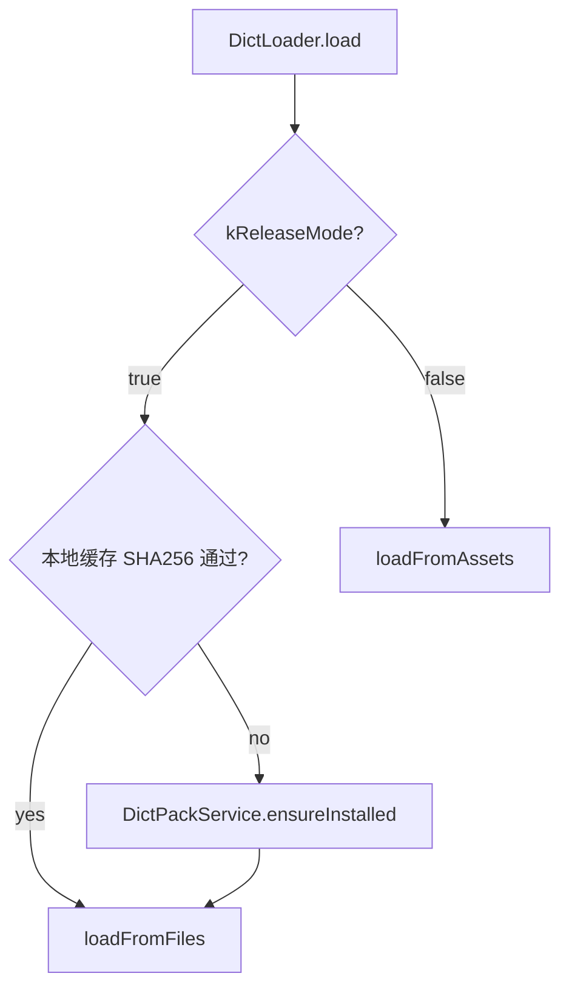

# 词典包 CDN 交付（Sprint 12）

Release 构建不包含 `mvp_dict.json` / `mvp_dict_aliases.json` assets；首次启动从 CDN 下载并缓存到应用支持目录。Debug / Profile / `flutter test` 仍读 bundled assets，**零网络依赖**。

## 加载分支

| 条件 | 行为 |
|------|------|
| `kReleaseMode == false` | `DictLoader._loadFromAsset()` — `rootBundle` 读 `assets/dict/*.json` |
| `kReleaseMode == true`，缓存有效 | `DictLoader._loadFromFiles()` — `{ApplicationSupport}/dict/v1/` |
| `kReleaseMode == true`，缓存无效/缺失 | `DictPackService.ensureInstalled()` → `_loadFromFiles()` |



**失败策略**：Release 下载或校验失败时阻塞 `_StartupGate`，展示进度 / 错误 +「重试」；不静默进入无词典状态。

## 缓存路径

```
{ApplicationSupportDirectory}/dict/v1/
  mvp_dict.json
  mvp_dict_aliases.json
  manifest.json
```

## Manifest JSON Schema

```json
{
  "version": "2",
  "files": {
    "mvp_dict.json": {
      "url": "https://cdn.example.com/dict/v1/mvp_dict.json",
      "sha256": "<lowercase hex>",
      "sizeBytes": 6328036
    },
    "mvp_dict_aliases.json": {
      "url": "https://cdn.example.com/dict/v1/mvp_dict_aliases.json",
      "sha256": "<lowercase hex>",
      "sizeBytes": 678468
    }
  }
}
```

| 字段 | 说明 |
|------|------|
| `version` | 包版本号；v1.0 起 schema v2（义项 `primary` 标注） |
| `files.<name>.url` | 文件 CDN 绝对 URL |
| `files.<name>.sha256` | 小写 hex SHA256 |
| `files.<name>.sizeBytes` | 字节数（用于进度条） |

模板见 `poc/assets/dict/manifest.json`（checksum 与当前 assets 对齐，URL 为占位）。

## CDN 配置

生产 manifest URL 通过 `--dart-define` 注入：

```powershell
flutter build appbundle --release `
  --dart-define=DICT_PACK_MANIFEST_URL=https://cdn.example.com/dict/v1/manifest.json
```

Dart 侧：`DictPackService.manifestUrl`（`String.fromEnvironment('DICT_PACK_MANIFEST_URL')`）。

本地验收可用 mock HTTP 服务器指向 `publish_dict_pack.ps1` 输出目录。

## 发布流程

1. 更新 `poc/assets/dict/mvp_dict.json` + `mvp_dict_aliases.json`
2. 运行 `poc/scripts/publish_dict_pack.ps1` — 计算 SHA256、生成可上传 bundle
3. 上传至 CDN；更新远程 `manifest.json` URL
4. `poc/scripts/build_release.ps1` — 剔除 dict assets、跑测试、打 AAB

## v1.3 扩展点

`DictPackService` 按 manifest `version` 与多文件条目设计；v1.0 仅 MVP pack（`dict/v1/`）。大词典 Pro 包可复用同一服务，切换 manifest URL 或 `version` 字段。

## 验收

| 场景 | 期望 |
|------|------|
| `flutter test` | 全绿；`kReleaseMode == false`，无 CDN 请求 |
| Debug 真机 | 启动即查词，无需联网 |
| Release 真机（清数据） | 首次启动下载 ~5.5 MB → 查词正常 |
| Release 二次启动 | 读缓存，无下载 |
| SHA256 不匹配 | 报错 + 重试 UI |
