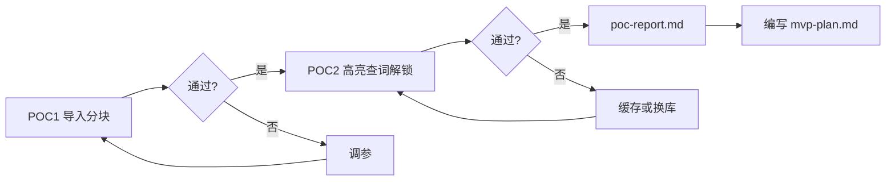

# POC 验证计划

| 字段 | 内容 |
|------|------|
| 文档版本 | v1.0 |
| 状态 | POC1 已完成；POC2 #7–#12 已完成 |
| 最后更新 | 2026-06-26 |
| 关联 PRD | [PRD v0.2](./PRD-v0.2.md) |
| 技术选型 | [tech-stack.md](./tech-stack.md) |

---

## 目标

在全面 MVP 开发前，验证以下高风险假设：

1. 大体积 EPUB/TXT 按块导入与切换不卡死（P0-05）
2. HTML span 与 TXT TextSpan 高亮 + 查词交互流畅（P0-06）
3. 假解锁逻辑与额度边界正确（P1-10 前置）

通过后产出 [poc-report.md](./poc-report.md)（执行后撰写，本文档为计划）。

---

## 执行约束

| 项 | 说明 |
|----|------|
| 时间盒 | 每项 POC 2–3 天，不过线则调参而非无限延期 |
| 测试机 | 至少 1 台中端 Android + 1 台 iPhone |
| 测试书 | 1 本 Gutenberg EPUB（带图）+ 1 本超长 txt 网文 |
| 代码范围 | 独立 Flutter 最小工程，非完整 App |

---

## POC1 — 导入与分块（P0-05）

### 范围

- `epubx` 解析 EPUB spine 与目录
- 复制资源到 `books/{bookId}/assets/`
- 块 HTML 路径重写
- Drift 写入 `books` / `chapters` / `content_blocks` / `parse_quota`
- TXT：正则分章 + plain 块文件
- 按块加载并渲染（**无高亮、无查词**）

### 不做

- 词库、查词面板、真实广告 SDK、书架 UI 美化

### 通过指标

| 指标 | 通过线 |
|------|--------|
| 单块加载到首屏 | < 800ms |
| 块切换 | < 500ms |
| 导入 300+ 块的书 | 进程内存峰值 < 200MB |
| 连续加载 50 块后内存 | 稳定 < 150MB（无持续增长） |
| 滚动帧率 | 平均 ≥ 50fps |
| 带图 EPUB | 图片正常显示 |

### 失败预案

| 现象 | 对策 |
|------|------|
| 导入太慢 | Isolate 后台导入；延迟预处理 |
| 单块过大 | 子切阈值 12,000 字符 → 8,000 字符 |
| 内存涨 | 仅缓存当前块 ±1 |
| 图片路径错误 | 检查 assets 重写规则 |

---

## POC2 — 高亮、查词与解锁（P0-06）

### 范围

在 POC1 基础上增加：

- 10,000 词加载进内存 `Set`
- HTML：文本节点注入 `span.word` + `flutter_widget_from_html`
- TXT：`TextSpan` 逐词 + 虚线下划线
- 单击词 → 假词典 JSON 查词 → 底部面板
- 查词状态机四操作 + 当前块重绘
- `parse_quota` 假解锁：`index>=40` 拦截至全屏页，模拟广告 +100

### 通过指标

| 指标 | 通过线 |
|------|--------|
| HTML 预处理（约 500 词/块） | < 200ms |
| 标记「已会」后重绘 | < 300ms |
| 单击查词（JSON 词典） | < 100ms |
| 40,000 词 Set 冷启动加载 | < 500ms（后台 Isolate） |
| 滚动掉帧 | < 5% 时间 |
| 解锁边界 | index 39 可开，40 拦截 |

### 失败预案

| 现象 | 对策 |
|------|------|
| 预处理慢 | 缓存已注入 HTML 到旁文件 |
| 渲染慢 | 换渲染库或缩小单块 |
| 重绘闪屏 | 局部更新 span 而非整页 rebuild |
| TXT 点击不准 | 调整 TextSpan recognizer |

---

## 流程

> **当前进度（2026-06-24）**：POC1（任务 #1–#6）与 POC2（任务 #7–#12）均已验收通过，见 [poc-report.md](./poc-report.md) v1.0。

---

## 验收产出

POC 完成后 `poc-report.md` 须包含：

- 测试机型号与测试书名
- 各项指标实测数据
- 是否调整 12,000 字符 / 40 / 100 参数
- `epubx` / `flutter_widget_from_html` 最终拍板结论
- 是否进入 MVP 切片开发（是/否及阻塞项）
