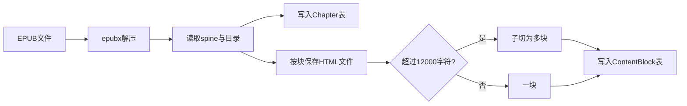
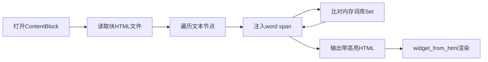
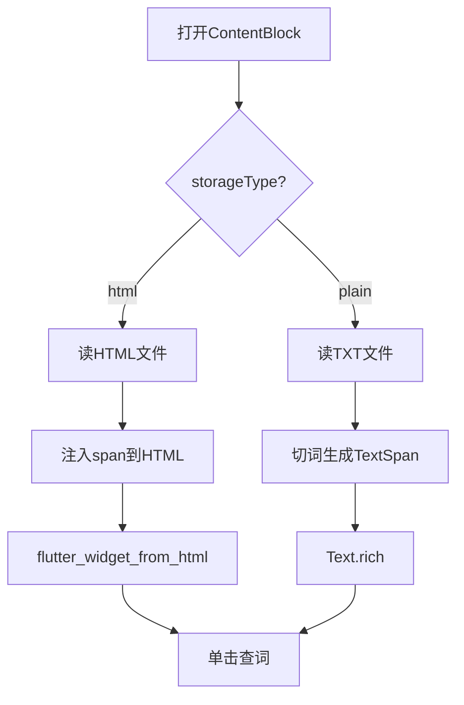

# 技术选型

| 字段 | 内容 |
|------|------|
| 文档版本 | v1.1 |
| 状态 | 已定稿 |
| 最后更新 | 2026-06-28（Sprint 11 去广告 + 时长埋点） |
| 关联 PRD | [PRD v0.3](./PRD-v0.3.md) |

---

## 1. 跨平台框架

**决策：Flutter**

| 考量 | 说明 |
|------|------|
| 阅读器渲染 | 自绘引擎，适合自定义 HTML 词 span 与高亮样式 |
| 性能 | AOT 编译 + Isolate，适合分批预处理与大文本 |
| 双端一致性 | 日系极简 UI 在 iOS / Android 表现统一 |
| 本地生态 | Drift、path_provider、file_picker 等成熟 |

未选 React Native 的原因：大文本 + 逐词高亮在 RN 侧常需额外原生模块；未选原生双端的原因：单人/小团队成本过高。

---

## 2. 本地数据库

**决策：Drift（单库）+ 运行时内存 `Set<String>` 词库缓存**

| 组件 | 用途 |
|------|------|
| Drift (SQLite) | 书籍、章节、块元数据、词库、进度、统计、解锁额度 |
| 内存 `Set<String>` | 已知词 O(1) 查询，启动时从 `known_words` 表加载 |

未采用双库（Drift + Isar）的原因：小说阅读词库规模通常 5,000–40,000 词，Drift + 内存 Set 足够；后续若需拓展学术词包，可通过 `known_words.source` 字段扩展。

表结构详见 [数据模型](./data-model.md)。

---

## 3. EPUB 处理策略（路线 C）

**决策：保留 HTML，渲染前预处理注入高亮 span**

### 3.1 方案对比（摘要）

| 路线 | 做法 | 结论 |
|------|------|------|
| A 原版富文本 | 渲染后像素级点词 | 开发成本最高，未采用 |
| B 纯文本管线 | EPUB 转 TXT，TextSpan 高亮 | 丢失排版，未采用 |
| **C 折中（采用）** | 保留 HTML，预处理注入 span | 保留排版 + 交互可控 |

### 3.2 导入管线



### 3.3 阅读管线



### 3.4 降级策略

单块 HTML 预处理失败时，该块降级为纯文本渲染（`storageType=plain`），不影响全书其他块。

### 3.5 EPUB 资源策略

- 导入时将图片、CSS 等资源复制到 `books/{bookId}/assets/`
- 块 HTML 内 `src`/`href` 重写为相对路径 `assets/...`
- 确保 `flutter_widget_from_html` 可正确加载本地资源

### 3.6 TXT 处理策略

- 导入：正则分章或按 12,000 字符切块 → 存 `.txt` 块文件 → `storageType=plain`
- 阅读：读块文本 → 按空白切词 → 归一化 → 比对 Set → 构建 `TextSpan` 列表
- `unknown`：`TextStyle(decoration: TextDecoration.underline, decorationStyle: TextDecorationStyle.dashed)`
- 与 EPUB 共用：查词面板、状态机、重绘当前块逻辑

**分章正则（优先匹配）：**

```
/^\s*(chapter|ch\.?)\s+(\d{1,4}|[ivxlcdmIVXLCDM]+)\b/im
```

**兜底规则：** 无任何主正则命中 → 按 12,000 字符（`String.length`）切块，Chapter 标题「第 N 段」。

---

## 4. 阅读器组件与双管线

| 组件 | 选型 | 说明 |
|------|------|------|
| HTML 渲染 | `flutter_widget_from_html`（POC 可对比验证） | 自定义 WidgetFactory 处理 `span.word` |
| EPUB 解析 | `epubx`（POC 验证） | 纯 Dart，无原生依赖 |
| TXT 渲染 | `Text.rich` + `TextSpan` | 逐词可点击 |
| 词点击 | span/TextSpan `Recognizer` 或 `TapGestureRecognizer` | 回调归一化词形与是否 unknown |
| 查词面板 | 居中 `showGeneralDialog` / `LookupCard` 或 `LookupVariantCard` | 变形词双 Chip Tab；原形路径 UI 不变；主题 `primary` 强调色 |
| 读音 | `flutter_tts` | 朗读单词本身（非音标 TTS）；封装于 `word_pronunciation.dart` |
| 阅读偏好 | `shared_preferences` + `ReaderPreferences` | 字号、行距、背景色、`chromeColor`、`unknownHighlightColor`、`lookupCardColor`；`toggleNightMode()` |
| 顶底栏 | `Stack` overlay + `AnimatedSlide`/`AnimatedOpacity` | 顶栏精简；底栏章节导航 + 三图标；**不改变** `CustomScrollView` 视口高度 |
| 滚动 | 垂直 `SingleChildScrollView` / `CustomScrollView` | 块内滚动；块末接下一键 |

### 双管线流程



### 阅读器交互默认值

| 项 | 默认值 |
|----|--------|
| 翻页方式 | 垂直滚动 |
| 查词面板 | 居中 Dialog（非底部 sheet） |
| 读音 | `flutter_tts` 朗读当前词 |
| 字号 | 17（可调 14–24，`SharedPreferences`） |
| 行距 | 1.6（可调 1.4–2.0） |
| 背景色 | 白（可选米黄、深灰夜间） |
| 生词高亮 | 虚线下划线；`decorationThickness` 1.5；颜色随主题（日间蓝 / 夜间浅蓝） |
| 块末行为 | 自动加载下一块 |
| 顶底栏 | 点击正文切换显隐；overlay 不改变正文布局；底栏含章节 prev/next |

---

## 5. 块存储

**决策：应用私有目录，每块一个文件，不进数据库 BLOB**

```
{appDocuments}/books/{bookId}/
  ├── cover.jpg
  ├── assets/          # EPUB 图片、CSS
  ├── block_0000.html
  ├── block_0001.txt
  └── ...
```

| 理由 | 说明 |
|------|------|
| 性能 | 避免 SQLite 存大文本拖慢查询 |
| 内存 | 按需读取当前块 |
| 备份 | 可与数据库一并打包导出 |

数据库 `content_blocks` 表只存路径、字数、状态等元数据。

---

## 6. 词归一化与高亮样式

### 6.1 归一化规则（MVP v1）

| 步骤 | 规则 | 示例 |
|------|------|------|
| 1 | Unicode 小写 | `Bright` → `bright` |
| 2 | 去除首尾标点 | `"word,"` → `word` |
| 3 | 缩写整词保留 | `don't` → `don't` |
| 不做 | 词干化 / 词形还原 | `brightly` 保持 `brightly` |

归一化结果写入 `data-word` 属性；页面显示文本保持书中原样。

### 6.2 高亮样式

| CSS 类 | 效果 |
|--------|------|
| `.word.unknown` | `text-decoration: underline; text-decoration-style: dashed;` |
| `.word.known` | 无额外样式 |

### 6.3 查词后高亮刷新（Sprint 9.7）

| 项 | 机制 |
|----|------|
| 词库查询 | 内存 `KnownWordsCache` Set，O(1) |
| HTML 刷新 | 每块 `highlightRevision` → `HtmlWidget.rebuildTriggers`；`customStylesBuilder` 读内存 Set |
| TXT 刷新 | 同上，`TxtHighlightedText` 按 `highlightRevision` 重建 TextSpan |
| 废弃 | 全局 `KnownWordsCache.revision` + `notifyListeners` 触发全部挂载块重排版 |
| 无变化跳过 | `lookupActionNeedsRedraw()`：确认已会 / 生词点「不认识」不重绘 |

### 6.4 HTML 示例

```html
<p>It was a <span class="word unknown" data-word="bright">Bright</span> cold day.</p>
```

---

## 7. 离线词典

### MVP（已定，Sprint 6 + Sprint 12 拆包）

- **Debug / Test**：内置 **JSON 词典** `assets/dict/mvp_dict.json`（**10k** 词条，ECDICT 裁剪，约 **6.0MB**，manifest **v2**）+ `mvp_dict_aliases.json`（**~14k** 变形，约 **0.65MB**）
- **Release**：词典 **不随 AAB**；`DictPackService` CDN 下载 + SHA256 缓存 → 详见 [dict-pack-delivery.md](./dict-pack-delivery.md)
- 数据来源：ECDICT 裁剪（MIT License，P1-01 ✅）
- 构建：`poc/scripts/build_mvp_dict.py`；发布：`poc/scripts/publish_dict_pack.ps1` + `build_release.ps1`
- 运行时：`DictLoader.load()` 按 `kReleaseMode` 分支；`lookup` / `resolve` 接口不变
- 查词 UI：`hasVariantTabs` ? `LookupVariantCard` : `LookupCard`；`summaryForVocab()` 扁平摘要写入 `vocab_entries.definition`

**`DictEntry` 结构**（`poc/lib/vocab/dict_entry.dart`）：

| 字段 | 说明 |
|------|------|
| `word` | 词条原形 |
| `phonetic` | IPA 音标 |
| `senses` | `DictSense[]`：`pos` + `meanings: DictMeaning[]`（`text` + `primary`） |
| `examTags` | 考研 / 四级 / 六级 / 雅思 |
| `englishDefinition` | 英文释义（详情页） |
| `fullTranslation` | 中文原文（详情页） |
| `exchange` | 词形变化（`formatExchange()` 解析） |
| `collins` / `oxford3000` | 徽章 |

**`DictLookupResult` 结构**（`poc/lib/vocab/dict_lookup_result.dart`，Sprint 10）：

| 字段 | 说明 |
|------|------|
| `tappedWord` | 用户点击的表面词形 |
| `entry` | 释义来源（lemma 的 `DictEntry`；miss 时为 null） |
| `alias` | `DictAliasMeta?`：`lemma`、`exchangeKey`、可选 `phonetic` |
| `hasVariantTabs` | `alias != null && alias.lemma != tappedWord` → `LookupVariantCard` |

### P1（待定）

- 按需下载完整词典包
- 格式候选：StarDict / MDX / 扩展 JSON

---

## 8. 关键参数

| 参数 | 默认值 | 单位 | 用途 |
|------|--------|------|------|
| 长章子切阈值 | 12,000 | 字符数（`String.length`） | 超过则 1 章拆为多个 ContentBlock |
| v1.0 全书可读 | `totalBlocks` | 块 | 导入时 `parse_quota.unlockedBlockCount` |
| 阅读时长埋点 | 秒级累计 | 秒 → 分钟 | `ReadingSessionTracker` → `incrementDailyMinutes` |

---

## 9. 待定（P1 / v1.1+）

| 项 | 状态 |
|----|------|
| 完整离线词典 | StarDict / MDX（MVP 已用 JSON） |
| 词典 CDN 分发 | ✅ Sprint 12：Release CDN + Debug bundled（[dict-pack-delivery.md](./dict-pack-delivery.md)） |
| 词干化 | Porter stemmer 等（可选） |
| Pro IAP | `in_app_purchase`（v1.1 预备；见 monetization.md） |
| HTML 渲染库 | POC 最终确认 widget_from_html |
| epubx | POC 验证结论 |
