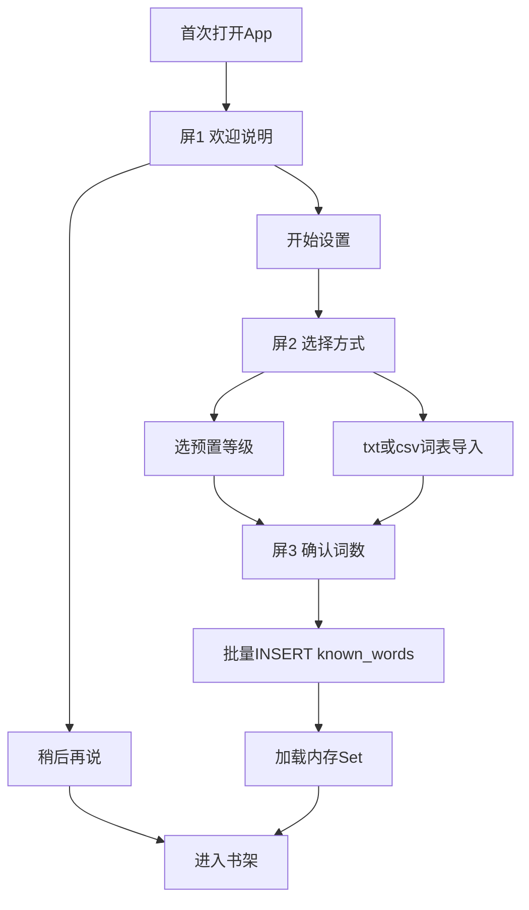
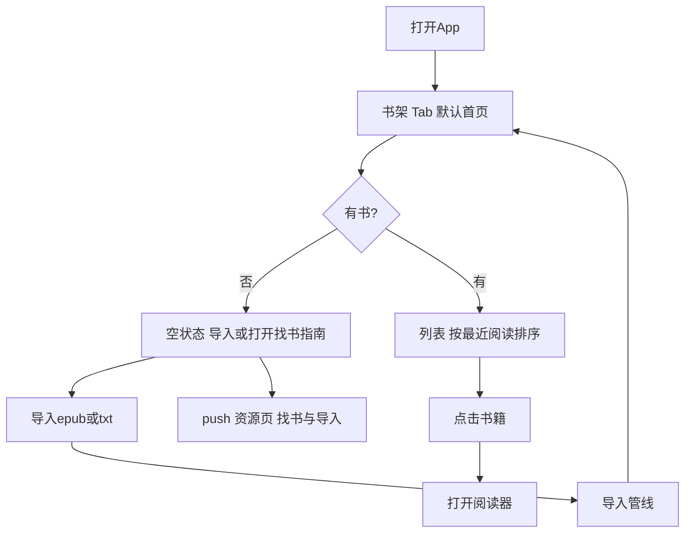
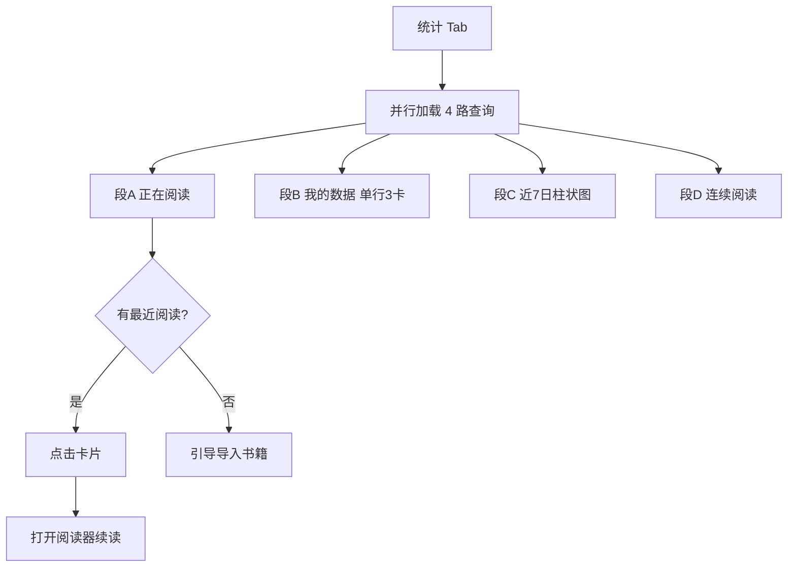
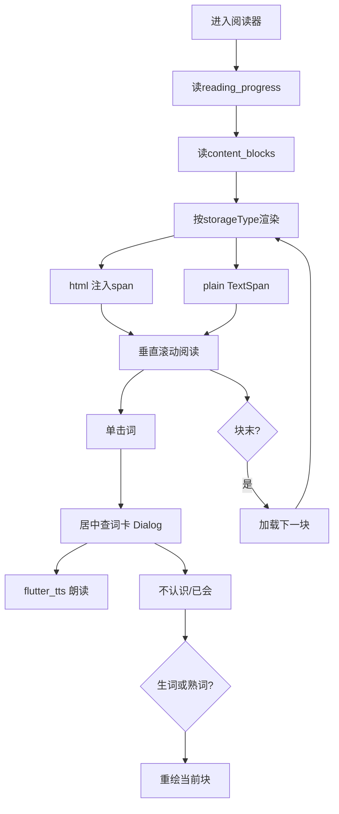
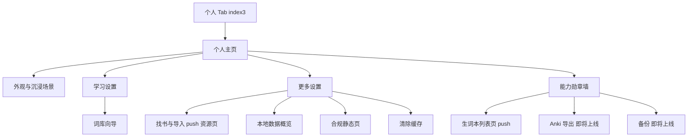

# 用户流程

| 字段 | 内容 |
|------|------|
| 文档版本 | v1.2 |
| 状态 | 已定稿 |
| 最后更新 | 2026-06-28（Sprint 11 全书可读 + 生词本列表） |
| 关联 PRD | [PRD v0.3](./PRD-v0.3.md) |
| 数据模型 | [data-model.md](./data-model.md) |

---

## 1. 首次启动 — 词库冷启动向导

| 步骤 | 用户操作 | 数据写入 |
|------|----------|----------|
| 屏1 | 开始设置 / 稍后再说 | 无 |
| 屏2 | 选四级/六级/托福/熟练 或 导入词表 | 无 |
| 屏3 | 确认 | `known_words`（`source=preset_*` 或 `import_file`） |

**跳过路径：** 词库为空 → 首次进阅读器显示轻提示 → 设置中可补做。

**重选等级：** 设置 → 词汇量 → 追加合并 `known_words`；「重置词库」清空后重设。

---

## 2. 书架

| 卡片信息 | 数据来源 |
|----------|----------|
| 封面 | `books.coverPath` |
| 书名/作者 | `books.title` / `books.author` |
| 进度 % | `reading_progress` + `totalBlocks` |
| 最后阅读 | `reading_progress.updatedAt` |

---

## 3. 统计 Tab — 仪表盘

| 区块 | 展示 | 数据来源 |
|------|------|----------|
| 正在阅读 | 封面 40×60、书名/作者、进度条（无词汇数字） | `getLastReadBook()` |
| 我的数据 | 今日新词、今日阅读、累计时长 | `getTodayNewWords()`、`getDailyMinutesTrend()`、`getTotalReadingMinutes()` |
| 近 7 日 | 分钟柱状图 | `reading_stats_daily`（`bookId IS NULL`） |
| 连续阅读 | 7 天圆点 + 连续天数 | 由近 7 日趋势计算 |

**与书架分工：** 书架为书籍列表与管理入口；统计 Tab 的「正在阅读」为最近一书快照 + 快速续读，不替代书架。

**与词库 Tab 分工：** 累计已知词、预置等级覆盖进度、成长里程碑、**生词本词数**在词库 Tab 展示；统计 Tab 仅保留今日新词（行为快照），**不含任何词汇资产数字**（无累计已知、无生词本词数）。

**数据前提：** 阅读时长由 `ReadingSessionTracker` 在前台累计，`flush` 时调用 `incrementDailyMinutes` 写入 `reading_stats_daily.minutes`；切后台 / 退出阅读器时落盘。

---

## 3.5 词库 Tab — 词汇成长与生词本

| 区块 | 展示 | 数据来源 |
|------|------|----------|
| 已知词数 | 累计已知 + 追加/导入入口 | `countKnownWords()` |
| 等级进度 | 预置词表覆盖进度条 | `vocab_progress.dart` |
| 成长里程碑 | 500 / 1000 / 5000 词徽章 | `MilestoneCard` |
| 生词本 | 标题 + 副标题 + 右侧 `N 词` | `countVocabEntries()` |

| 生词本入口 | 行为 |
|------------|------|
| 点击 Card | push `VocabNotebookScreen` 列表页 |
| 列表 | `watchVocabEntries()` 按 `updatedAt DESC`；行展示词、释义/例句摘要 |
| 点击行 | `WordDetailScreen` 查看释义与查词操作 |
| 空状态 | 「阅读时点击「不认识」，生词会收录在这里」 |

生词本词数**主展示**在词库 Tab；个人 Tab 勋章墙为次要数字（同 query，不重复主位）。

---

## 4. 阅读器

| 交互 | 行为 |
|------|------|
| 单击词 | 居中查词卡（Dialog）+ TTS 读音；「不认识 / 已会」双按钮 |
| 单击非词区 | 切换顶底栏（overlay，正文不跳动） |
| 底栏设置 | 字号/行距/背景色 |
| 底栏夜间 | 一键切换夜间模式（高亮/chrome/查词卡同步） |
| 底栏目录 | Chapter 列表 → 跳第一块 |
| 底栏 prev/next | 跳转相邻章首块 |
| 块末 | 自动下一块 |

---

## 5. 查词状态机

详见 [data-model.md §9](./data-model.md#9-查词状态机与表写入)。

| 操作 | 写入 |
|------|------|
| 已会（生词点「已会」） | `known_words` INSERT |
| 加入生词本（熟词点「不认识」） | `known_words` DELETE + `vocab_entries` INSERT |
| 确认已会（熟词点「已会」） | `known_words` INSERT 幂等 |
| 收藏（`starWord` API，非查词卡 UI） | `vocab_entries` INSERT/UPDATE `starred=true` |
| 取消收藏 | `vocab_entries` UPDATE `starred=false` |

每次操作后：更新内存 Set → 仅重绘当前块。

---

## 6. 章节目录跳转

1. 用户点「目录」
2. `SELECT * FROM chapters WHERE bookId=? ORDER BY orderIndex`
3. 用户点第 N 章
4. 取该章 `blockOrderInChapter=0` 的 `content_blocks`
5. 更新 `reading_progress` → 渲染该块

---

## 7. 阅读时长统计（Sprint 11）

| 组件 | 行为 |
|------|------|
| `ReadingSessionTracker` | 阅读页前台累计秒数；`pause`/`resume` 随 App 生命周期 |
| `flush` | 退出阅读器或切后台时写入 `incrementDailyMinutes` |
| `reading_stats_daily` | `bookId IS NULL` 为全站合计；可选 per-book 行同步累加 |
| 统计 Tab | `getDailyMinutesTrend` / `getTotalReadingMinutes`；切 Tab 时 `onTabActivated` 刷新 |

---

## 8. 学习设置 — 词库管理

| 入口 | 功能 |
|------|------|
| 个人 → 学习设置 | 已知词数、重跑向导、重置词库 |
| 词库 Tab | 累计已知、等级进度、成长里程碑、追加等级、导入词表 |
| 词汇量设置 | 重跑向导逻辑（追加合并） |
| 导入词表 | txt/csv → `known_words` |
| 重置词库 | 清空 `known_words` + 重建 Set |
| 词典 | MVP JSON；P1 按需下载 |

**职责划分**：词库 Tab 侧重「词汇成长展示 + 生词本入口 + 追加 / 导入」（见 §3.5）；学习设置侧重「向导 / 重置」。累计已知词主展示在词库 Tab，统计 Tab 不重复。

---

## 10. 个人中心流程

| 页面 | 行为 |
|------|------|
| 个人主页 | 无 AppBar；头部状态语（无统计数字）；下拉刷新勋章墙 |
| 能力勋章墙 | 生词本 / Anki / 备份 三格；生词本 push 列表页 |
| 外观 & 沉浸场景 | 读写 `ReaderPreferences`；壁纸随动开关写 `AppPreferences` |
| 更多设置 | 分组列表含「找书与导入」；页脚展示匿名本地 UUID |
| 阅读器设置浮层 | **不变**；与个人中心外观共用 SP 键，浮层为会话内即时调节 |

### 数字主权（Tab 间不重复）

| Tab | 唯一主数字 / 内容 | 移除 |
|-----|------------------|------|
| 书架 | 书本列表、进度 | — |
| 统计 | 今日新词、今日/累计时长、连续天数、7 日图、续读卡片 | 在读卡片上的「生词本 X 词」 |
| 词库 | 已知词数、等级进度、里程碑、生词本入口 | — |
| 个人 | 状态语（无统计数字）、勋章墙、设置 | 头部「连续 X 天 / 累计 Y 分钟」；装备卡 Tab 跳转 |

---

## 9. 导入管线摘要

| 格式 | 流程 |
|------|------|
| EPUB | epubx → assets 复制 → spine 分块 → Chapter + ContentBlock(html) |
| TXT | 读文件 → 正则分章或切块 → Chapter + ContentBlock(plain) |

两者均：`insert Book` + `initParseQuota(unlockedBlockCount = totalBlocks)`（v1.0 全书可读）。
