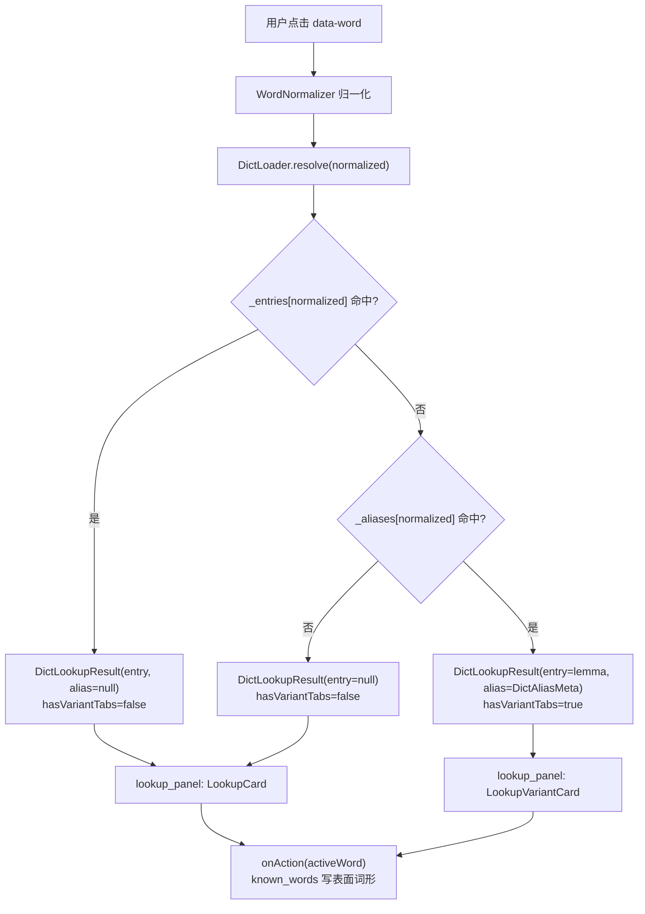

# 词形查词与已会粒度（产品规格）

> **状态：✅ 已实现（Sprint 10，2026-06-28）** — 查词层智能回落，词库层按表面词形独立记录。技术实现见 `docs/future-stemming.md` 方案 B。

## 背景

词典 `mvp_dict.json` 以**原形（lemma）**为键，屈折变形（如 `ringing`、`was`）仅挂在 ECDICT `exchange` 字段。Sprint 10 前查词仅精确匹配，点击变形词会显示「词典未收录该词」。

## 产品决策（已确认）

### 查词：双 Tab + 回落原形

- 点击变形词（如 `ringing`）时，查词卡顶部展示 **当前词形 | 原形** 两个 Tab，交互参考不背单词。
- 当前词形 Tab：显示语法关系（如「ring 的现在分词」）及回落释义。
- 原形 Tab：显示完整义项；「查看详细释义 >」进入当前 Tab 词形详情页。
- 用户可在任一 Tab 下直接操作（标记已会、发音等），**无需**「同时标记原形」勾选框。

### 已会 / 高亮：仅针对当前表面词形

- `known_words` 与阅读高亮**不**因原形已会而自动隐藏变形。
- 理由：阅读中见到变形词仍可能愣住；「会原形 ≠ 会在语境里即时读懂变形」。
- 标记已会时，只写入用户当前操作的词形（如点 `ringing` 的 ✓ → 仅存 `ringing`）。
- 若用户也会 `ring`，需切换到 `ring` Tab 单独标记。

### 说明文档：个人主页，不在查词卡内

- 不在查词卡内加常驻提示文案，避免干扰阅读节奏。
- 用户说明见 **个人 → 学习设置 → 词形查词说明**（`assets/legal/word_variant_lookup.md`）。

## 实现范围（Sprint 10 ✅）

| 模块 | 改动 |
|------|------|
| `mvp_dict_aliases.json` | 变形 → lemma 别名表（`lemma`、`exchangeKey`、可选 `phonetic`） |
| `build_mvp_dict.py` | `--include-exchange-aliases` + `--aliases-output`；`generate_aliases_from_dict.py` 可从现有 JSON 重建 |
| `dict_loader.dart` | `resolve()`：精确命中 → 别名 → miss；`lookup()` 不变 |
| `dict_lookup_result.dart` | `DictLookupResult` + `DictAliasMeta`；`hasVariantTabs` 控制 UI 分支 |
| `lookup_variant_card.dart` | 双 Tab UI；✓ 针对当前选中 Tab 的词形 |
| `lookup_card.dart` | **原形路径零变化**；精确命中仍用现有卡片 |
| `lookup_panel.dart` | `hasVariantTabs` ? `LookupVariantCard` : `LookupCard` |
| `known_words_cache.dart` | **不改**回落逻辑，保持表面词形精确匹配 |
| `txt_highlighter.dart` / `html_highlighter.dart` | **不改**高亮判定 |

### `DictLoader.resolve()` 回落顺序

运行时资产：`poc/assets/dict/mvp_dict.json`（lemma 键）+ `poc/assets/dict/mvp_dict_aliases.json`（变形 → lemma 别名）。启动时 `DictLoader.load()` 在 isolate 中并行解析两文件；别名文件缺失时 `resolve()` 退化为仅精确命中。

1. `_entries[normalized]` 命中 → 原形展示，**无 Tab**（即使该词也是某 lemma 的变形）
2. `_aliases[normalized]` 命中 → 取 `lemma` 条目 + `DictAliasMeta` → `LookupVariantCard`
3. 均未命中 → `LookupCard` 显示「词典未收录该词」

### UI 分支（`lookup_panel.dart`）

| `hasVariantTabs` | 组件 | 说明 |
|------------------|------|------|
| `false` | `LookupCard` | 精确命中或 miss；Sprint 5–9 行为不变 |
| `true` | `LookupVariantCard` | 双 Chip Tab（表面词形 \| 原形）；✓ / 详情 / 发音针对**当前 Tab 词形** |

`lookup()` 仍供词库摘要等场景使用，**不参与**阅读器查词回落。

## 不在范围

- 查词卡内「同时标记原形」开关（Tab 直达即可）
- 高亮随原形联动
- 词根 / 近义 / 派生 Tab
- 每个变形独立义项（除非 ECDICT 有独立词条）
- 运行时 Porter 词干化（仍为 P2，见 `future-stemming.md` 方案 A）

## 相关文件

| 文件 | 说明 |
|------|------|
| `docs/future-stemming.md` | 别名 / 词干化技术候选 |
| `poc/assets/legal/word_variant_lookup.md` | 用户向说明 |
| `poc/lib/vocab/dict_entry.dart` | `exchange`、`formatExchange()`、`formatVariantGrammarNote()` |
| `poc/lib/reader/lookup_variant_card.dart` | 变形词双 Tab 查词卡 |
